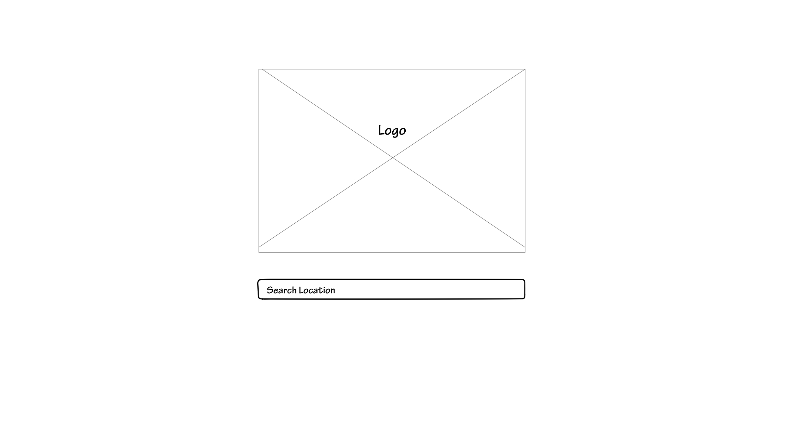
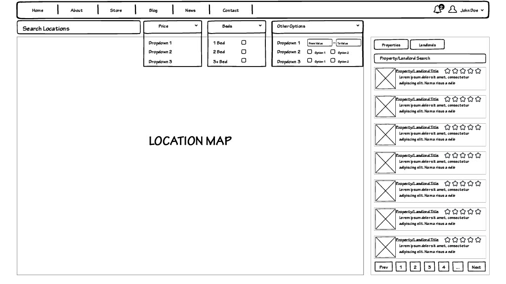
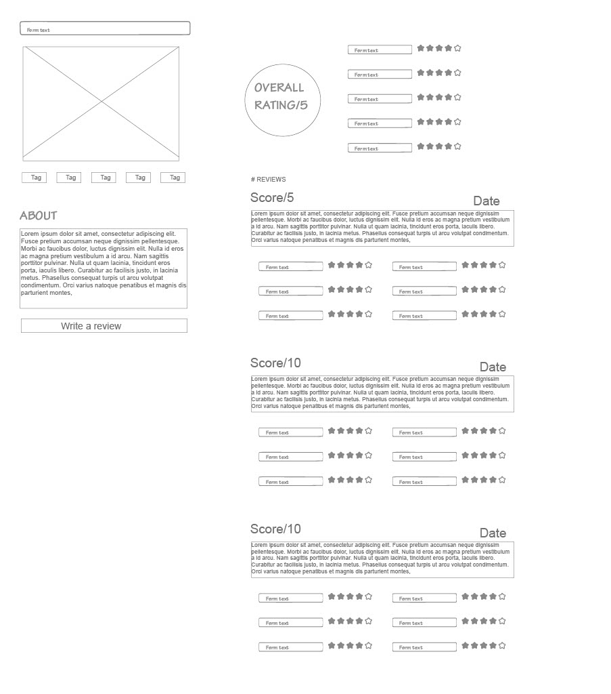
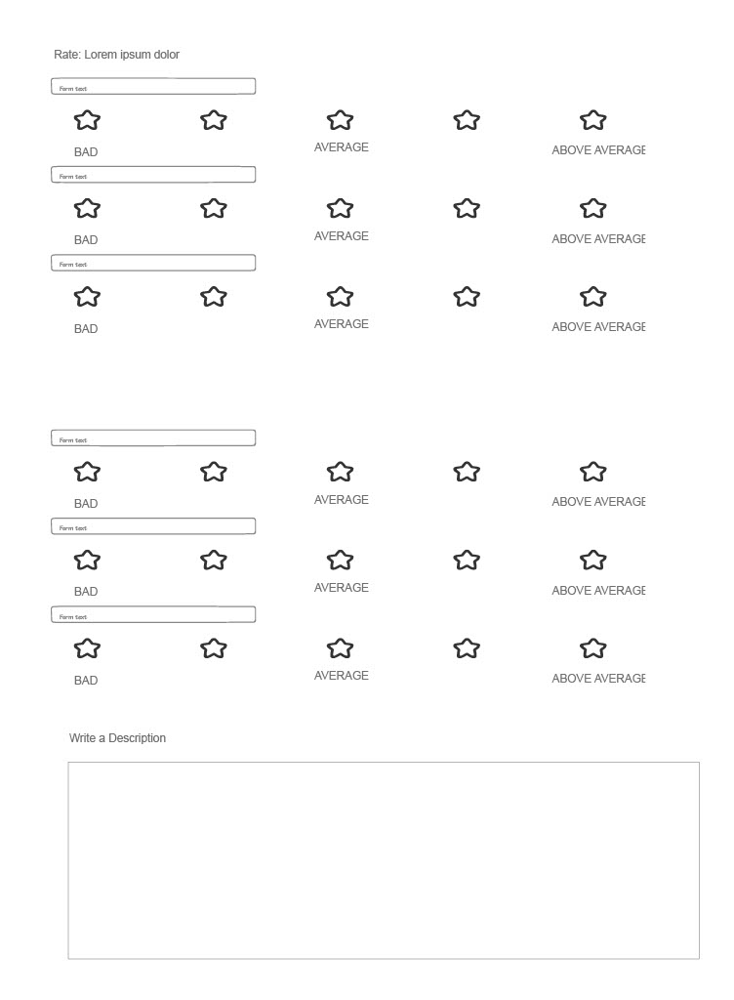

# Wireframe

This is the landing page of the website. Users will be able to search for their desired location using the centrally located search bar. Upon pressing enter the user will be taken to the following page.

This page is where users will be able to find their properties of choice. Users will be able to narrow their search to fit their specific needs using search filters present at the top of the page. The location map and side bar will visualize their search, giving users a display in accoradance with their search parameters. The navigation bar on the top of the page will serve as an easy way to log in, access a user account, or jump to other pages on the site. When a user clicks on a property in the side bar they will be taken to the next page.

This page is unique for every property on the website. An average of all user reviews will be displayed at the top of the page with individual categories broken up into different ratings out of 5 stars. Below these ratings is a scrolling list of individual full ratings. These ratings will feature each users scoring in the provided rating categories as well as a short text post. The left side of the page will feature a photo of the property, tags that users often use to describe the property, and an about section featuring information on the property if available. Below the about page is the "Write a review" button which will take users to the next page.

